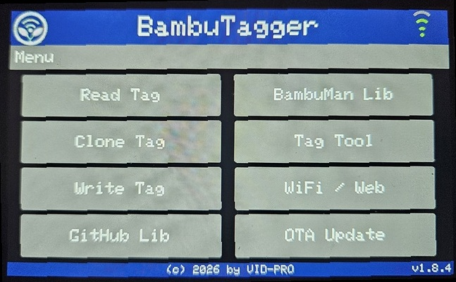

#  BambuTagger-Touch

An ESP32-based tool for reading, cloning, and writing Bambu Lab filament spool RFID tags.  
Designed for the **Guition JC8048W550** 5.0" 800×480 capacitive-touch display with a dedicated RC522 RFID module on the HSPI bus.



---

## Features

| Category | Details |
|----------|---------|
| **RFID** | Read, clone, and write Bambu Lab MIFARE Classic 1K spool tags |
| **Magic card support** | Gen1A (0x40/0x43 backdoor), Gen2 (CUID/FUID implicit), Gen3 (APDU), Gen4 (GTU/GDM CF-command) |
| **Key derivation** | HKDF-SHA256 with Bambu Lab salt — no hardcoded keys |
| **Touch UI** | Full 800×480 TFT with header (logo, title, WiFi icon), subheader (contextual title), footer, and touch-friendly buttons |
| **Web UI** | Files / Dumps / Status / WiFi / BambuMan tabs |
| **GitHub browser** | Browse & download dump files on-device via touch |
| **OTA updates** | Check & flash latest release from GitHub with live progress bar |
| **BambuMan catalog** | On-device browser + web search; sync downloads full ZIP and extracts data.bin files to FAT |
| **File management** | Upload `.bin` dumps, browse FAT directory tree, delete files 
| **WiFi** | Auto-STA on boot; AP fallback `BambuTagger` / `bambu1234`; signal-strength icon in header |
| **Serial debug** | Timestamped output; disable with `#define DEBUG_SERIAL 0` |

---

## Hardware

### Bill of Materials

| Component | Notes | Buy |
|-----------|-------|-----|
| **Guition JC8048W550** | ESP32-S3-N16R8, 5" 800×480 ST7262 RGB + GT911 touch | https://de.aliexpress.com/item/1005006715794302.html |
| **RC522** RFID module | SPI interface | https://de.aliexpress.com/item/1005006907801802.html |
| 2x JST 1.25-4p cables | 4pin, 20cm |   |


### Pin Assignments

**Display (parallel RGB565 via ST7262)**

| Signal | GPIO | Signal | GPIO | Signal | GPIO | Signal | GPIO |
|--------|------|--------|------|--------|------|--------|------|
| R0 | 8 | G0 | 5 | B0 | 45 | HSYNC | 39 |
| R1 | 3 | G1 | 6 | B1 | 48 | VSYNC | 41 |
| R2 | 46 | G2 | 7 | B2 | 47 | DE | 40 |
| R3 | 9 | G3 | 15 | B3 | 21 | PCLK | 42 |
| R4 | 1 | G4 | 16 | B4 | 14 | Backlight | 2 |
| | | G5 | 4 | | | | |

**Touch (GT911 via I2C)**

| Signal | GPIO |
|--------|------|
| SDA | 19 |
| SCL | 20 |
| RST | 38 |
| INT | 18 (unused in code; shared with RC522 CS) |

**RC522 (SPI on HSPI bus)**

| Signal | GPIO |
|--------|------|
| CS / SDA | 18 |
| RST | 17 |
| SCK | 12 |
| MOSI | 11 |
| MISO | 13 |
| 3.3V | 3.3V |
| GND | GND |

---

## Software

### Required Libraries (Arduino Library Manager)

| Library | Version |
|---------|---------|
| `LovyanGFX` | ≥ 1.x |
| `makerspaceleiden/rfid` (MFRC522) | latest |
| `ArduinoJson` | ≥ 7.x |
| `miniz` | Built into ESP32 Arduino core |
| `mbedTLS` | Built into ESP32 Arduino core |

### Board Settings (Arduino IDE)

| Setting | Value |
|---------|-------|
| Board | **ESP32S3 Dev Module** |
| Partition Scheme | **Custom** (select `partitions.csv`) |
| Flash Size | **16 MB** (OPI) |
| PSRAM | **OPI PSRAM** |
| Upload Speed | 921600 |
| Monitor Speed | **115200** |

> The sketch calls `FFat.begin(true)` — formats the FAT partition on first boot.

#### Custom partition table

Copy `partitions.csv` into the Arduino ESP32 core's partitions directory:

```
copy partitions.csv ^
   %LOCALAPPDATA%\Arduino15\packages\esp32\hardware\esp32\<version>\tools\partitions\
```

Then select **Tools → Partition Scheme → partitions**.

| Partition | Offset | Size | Notes |
|-----------|--------|------|-------|
| nvs | `0x9000` | 20 KB | WiFi creds, GitHub token |
| otadata | `0xE000` | 8 KB | OTA slot bookkeeping |
| **app0** | `0x10000` | **1408 KB** | +128 KB vs default_ffat |
| **app1** | `0x170000` | **1408 KB** | +128 KB vs default_ffat |
| **ffat** | `0x2D0000` | **1152 KB** | Dump file storage |

---

## Touch UI

### Navigation

All interaction is via tap:

- **Tap a button** to select an action
- **Tap a list entry** in any browser (GitHub, BambuMan, FAT) to navigate into a folder or select a file
- **Tap the header** (top 64 px, navy bar) on any screen to return instantly to the main menu
- **Tap `< BACK`** (list row) in GitHub, BambuMan, or Write Dump sub-directories to go up one level
- **Swipe vertically** or **tap the scrollbar** to scroll lists; tap above/below the thumb to jump

### Main Menu

```
┌──────────────────────────────────────────────┐
│  Logo    BambuTagger                 Wi-Fi   │  ← header (64 px)
│          Menu                                │  ← subheader (44 px)
├──────────────────────────────────────────────┤
│                                              │
│                Read Tag                      │
│                                              │
│               Clone Tag                      │
│                                              │
│              Write Dump                      │
│                                              │
│              GitHub Lib                      │
│                                              │
│              BambuMan                        │
│                                              │
│              Tag Tool                        │
│                                              │
│              System                          │
│                                              │
│              OTA Update                      │
│                                              │
├──────────────────────────────────────────────┤
│     (c) 2026 by BambuTagger    v1.8.0        │  ← footer (24 px)
└──────────────────────────────────────────────┘
```

### Screen Layout

Every screen has:
- **Header** – 64 px navy bar with 65×64 logo, centred "BambuTagger" title, and WiFi signal-strength icon (green arcs) or "AP" text
- **Subheader** – 44 px dark-grey bar with contextual title (e.g. "Tag Info", "Write Tag", "BambuMan Library")
- **Breadcrumb** – Light-grey path text below the subheader in browser screens when navigating subdirectories
- **Footer** – 24 px navy bar with "(c) 2026 by VID-PRO" centred and version number at the right edge

All buttons use centred text (`MC_DATUM`), and inactive list entries are `TFT_DARKGREY`. Scrollbars (30 px wide, proportional white thumb) appear in browsers when content overflows. Tap or swipe the scrollbar to navigate long lists.

The BambuMan Library shows two side-by-side buttons at the top level: **Sync Catalog** (quick, central-directory only) and **Full Download** (extracts all data.bin files to FAT).

### Menu sections

#### Read Tag
Hold a spool near the RC522. The sketch derives MIFARE keys from the tag UID using HKDF-SHA256, authenticates all 16 sectors, and displays filament type, colour, and weight.

#### Clone Tag
Reads the source tag sector-by-sector into RAM, then prompts for the destination tag. Writes every block using automatic magic-card detection (Gen1A → Gen4 → Gen3 → Gen2 → normal auth).

#### Write Dump
Browse the dump files stored on FAT using the on-device directory browser. Navigate sub-directories with the `< BACK` row; a breadcrumb path is shown below the subheader. Select a `.bin` file, present a target tag, and every block is written with the same detection strategy.

#### GitHub Lib
Browse the [Bambu Lab RFID Library](https://github.com/queengooborg/Bambu-Lab-RFID-Library) directly on-device. Requires WiFi. Navigate with `< BACK` row; a breadcrumb path is shown below the subheader. Files are saved to FAT mirroring the repository structure.

#### BambuMan Lib
Browse the [bambuman.ee](https://bambuman.ee/tags) community tag database in a 4-level hierarchy (Material → Type → Color → UID). A breadcrumb (e.g. `PLA > PLA Basic > Black`) is shown below the subheader. Two sync options: **Sync Catalog** (quick, catalog only via Range request) or **Full Download** (extracts all `data.bin` files to FAT).

#### Tag Tool
Manage Gen4 (GTU/GDM) and Gen2 (CUID/FUID) magic card backdoors — seal, unlock, or lock block 0. Displays current card mode details below the subheader.

#### System
Shows system status: WiFi mode, SSID, IP, free heap, FAT usage, and tag dump count. Includes a **Delete All Tags** button to remove all dumps and empty directories.

#### OTA Update
Checks GitHub releases for a newer firmware version and flashes it over-the-air.

---

## Web Interface

Open a browser to the ESP32's IP (shown in the header).

| Tab | Description |
|-----|-------------|
| **Files** | Navigate FAT directory tree, upload/delete `.bin` files, trigger tag writes |
| **Dumps** | Browse GitHub repository, download files to FAT |
| **BambuMan** | Sync catalog, search by material/colour, fetch & write tags |
| **System** | WiFi mode, IP, heap, FAT usage, tag dump count, delete all tags |
| **OTA** | Check for and apply firmware updates |
| **Config** | WiFi scan + connect, GitHub API token management |

Full REST API documentation is available in the source header.

---

## REST API

| Method | Path | Description |
|--------|------|-------------|
| `GET` | `/api/status` | WiFi mode, SSID, IP, selected dump path, FAT usage, `app_state` |
| `POST` | `/api/wifi` | `{"ssid":"…","pass":"…"}` — connect & save |
| `GET` | `/api/scan` | Array of nearby SSIDs |
| `GET` | `/api/list?path=…` | GitHub directory listing |
| `POST` | `/api/download` | `{"url":"…","path":"…"}` — download raw file to FAT |
| `GET` | `/api/files?dir=<path>` | FAT directory listing |
| `POST` | `/api/delete` | `{"file":"…"}` — delete a FAT file or empty directory |
| `POST` | `/api/deleteall` | Delete all dump files and empty directories |
| `POST` | `/api/writetag` | `{"path":"…"}` — load dump and start tag-write |
| `POST` | `/api/upload` | `multipart/form-data` — upload a `.bin` |
| `GET` | `/api/token` | Return saved GitHub token (masked) |
| `POST` | `/api/token` | Save GitHub API token to NVS |
| `POST` | `/api/bm/sync` | Download full bambuman.ee ZIP, extract data.bin files to FAT, build catalog |
| `GET` | `/api/bm/catalog` | Stream `/BM/catalog.json` |
| `GET` | `/api/bm/fetch?uid=…` | Fetch `data.bin` from bambuman.ee |
| `GET` | `/api/ota/check` | Compare running firmware to latest GitHub release |
| `POST` | `/api/ota/update` | Download and flash latest app binary |

---

## FAT Directory Structure

```
/
  BM/
    catalog.json             — bambuman.ee catalog index
  PLA/
    PLA Basic/
      Black/
        3AD82DAD.bin         — extracted dump
  PETG/
    PETG Basic/
      Black/
        A1B2C3D4.bin         — extracted dump
  ...
```

WiFi credentials and GitHub API token are stored in ESP32 NVS (not FAT).

---

## Building & Flashing

### Arduino IDE

1. Install **ESP32 board package** (≥ 3.x).
2. Install libraries: `LovyanGFX`, `makerspaceleiden/rfid`, `ArduinoJson`.
3. Select **Board → ESP32S3 Dev Module**, Flash Size **16 MB (OPI)**, PSRAM **OPI PSRAM**.
4. Copy `partitions.csv` into the ESP32 core's `tools/partitions/` directory.
5. Select **Partition Scheme → partitions**.
6. Upload.

### GitHub Actions

Push a `v*` tag to trigger an automated release build (`GHActions/release.yml`).

---

## Credits & References

- Dump files: [queengooborg/Bambu-Lab-RFID-Library](https://github.com/queengooborg/Bambu-Lab-RFID-Library)
- Community tag database: [bambuman.ee](https://bambuman.ee/tags)
- [RFID-Tag-Guide](https://github.com/Bambu-Research-Group/RFID-Tag-Guide)
- Display library: [LovyanGFX](https://github.com/lovyan03/LovyanGFX)
- RFID library: [makerspaceleiden/rfid](https://github.com/makerspaceleiden/rfid)

---

## License

This project is provided as-is for personal and educational use.  
Bambu Lab trademarks and spool tag data formats are the property of Bambu Lab.
